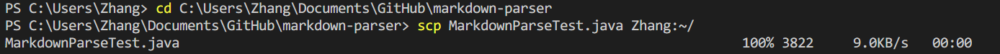

**This is Jianrui Zhang's Lab Report 3**

# Streamlining *ssh* Configuration

- ## create the config file to simplify the login process ##

- ## Now use ` ieng6 Zhang` to login ##

- ## Here is a simplified way to login with copy a file

# Setup Github Access from ieng6

- ## Here is the public key shown in Github ##

- ## Here is the public and private key stored in `.ssh` folder ##

- ## Now usekey when commit chages to Github from ieng6 account

# Copy whole directories

- ## screenshot of the copying process ##

- ## run SkillDemoTest in the ieng6 account ##

- ## Finally one line command that runs all
 

