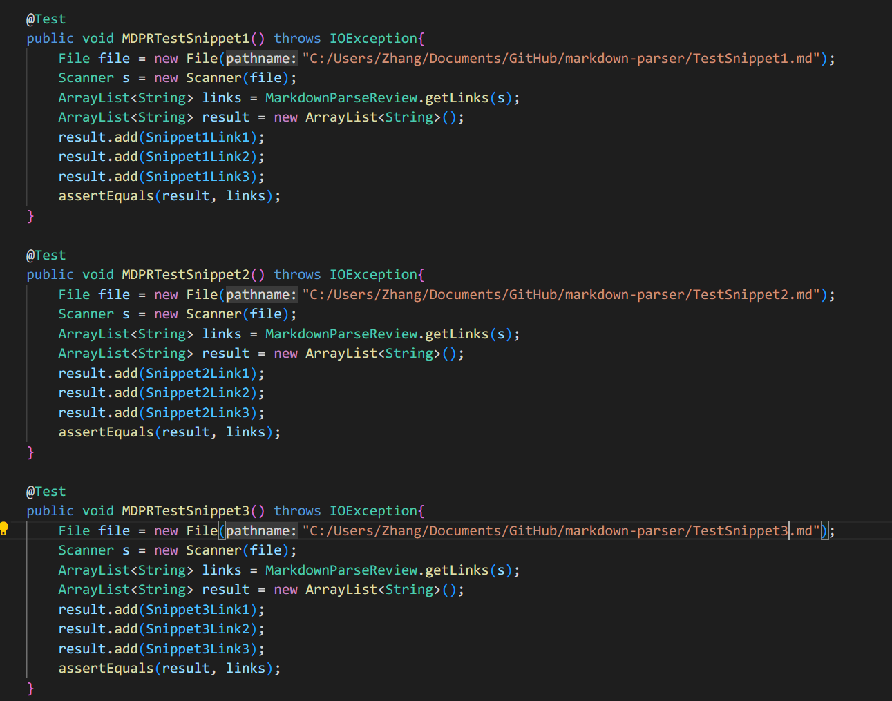

# This is Jianrui Zhang's Lab Report 4 

## MarkdownParse Snippet tests:

- [My Repo](https://github.com/JerryLove77/markdown-parser)

- [Reviewed Repo](https://github.com/yuxinguo13/markdown-parser)

Tests in `MarkdownParseTest.java`:

- Variables used:

- Test for my `MarkdownParse.java`:

- Test for reviewed `MarkdownParse.java`

Results for my implementation:

## non of three tests passed

## All of the errors are assertion errors 

##  my implementation failed to capture the proper link for each test.

Results for reviewed implementation:

## non of three tests passed

## There is a memory and an out of bounds exception, both of which need to be fixed in the implementation.

## Solution to the tests

Fixes for snippet 1:

Fixes for snippet 2:

Fixes for snippet 3:
