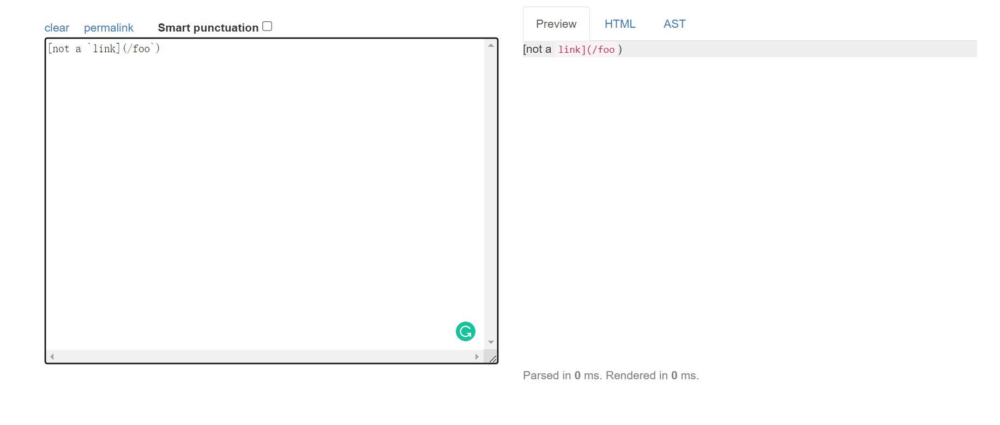

# **Jianrui Zhang's Lab Report 5**

## Different Test:

For demonstration purposes, I would use `342.md` and`14.md` as two examples of different output from `my-markdown-parser` and the recent implement of `markdown-parser`.

I was able to find the tests with different results using `vimdiff` on the result.

Here is the links to the test files:

[Test 342](https://github.com/nidhidhamnani/markdown-parser/blob/main/test-files/342.md)

[Test 14](https://github.com/nidhidhamnani/markdown-parser/blob/main/test-files/14.md)

## Test 342

- For Test 342, my implements gave the correct output, which should be zero.

- On left side, my implement returns null; however, given implement returns a link

- The main fix for test 342 is regarding backticks in markdown. Backtick detection is required when running through the "link" because of the particular functions of backticks.

- As this is a small fix, backtick detection in the getLinks method or a new method is required.

